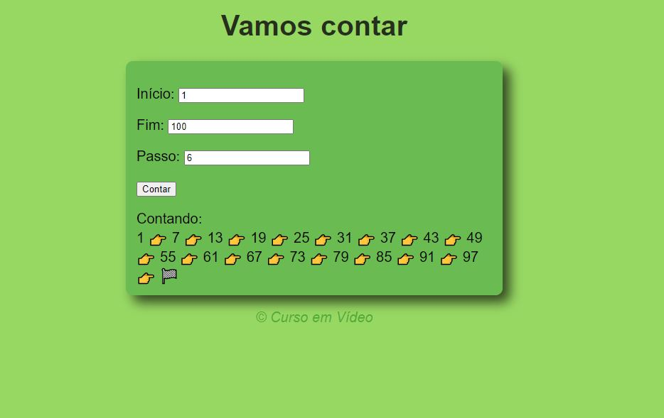

# Página que conta um intervalo de números conforme os dados inseridos

## Projeto de uma página que vai contar um intervalo de números conforme os dados inseridos,   No campo 'Início' você vai digitar o número inicial, no campo 'Fim' você vai digitar o número final e no campo 'Passo' você vai digitar o número do intervalo da contagem.   Feito com HTML, CSS e JavaScript.  Projeto realizado com o professor Gustavo Guanabara do Curso em Vídeo.👩🏽‍💻

### [👉🏽 Clique aqui para acessar a página](https://letsle.github.io/contador/) 

